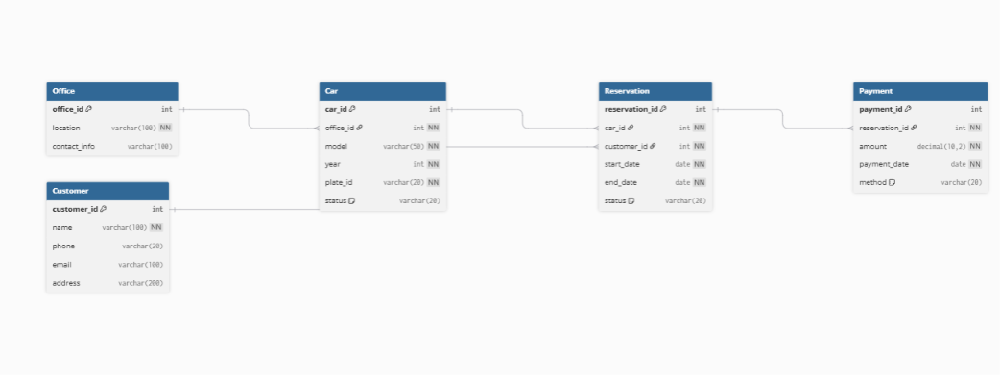

# 🚗 Car Rental System
A desktop application for managing a car rental business, built with Python (Tkinter) and Microsoft SQL Server. The system covers the full rental lifecycle: registering cars and customers, making reservations, handling pickups and returns, recording payments, and generating operational reports.

---

## 📋 Prerequisites

| Requirement | Version |
|---|---|
| Python | 3.8+ |
| Microsoft SQL Server | Express or full edition |
| ODBC Driver for SQL Server | 17 |
| pyodbc | Latest |

---

## ⚙️ Setup

### 1. Install Python dependencies

```bash
pip install pyodbc
```

### 2. Configure the database connection

Open `app.py` and update the connection settings at the top of the file to match your environment:

```python
SERVER   = "localhost\\SQLEXPRESS"   # your SQL Server instance
DATABASE = "CarRentalSystem"
```

The app uses Windows Authentication (`Trusted_Connection=yes`). Make sure your Windows user has access to the SQL Server instance.

### 3. Set up the database

Run the provided SQL script in SQL Server Management Studio (SSMS) or `sqlcmd`:

```bash
sqlcmd -S localhost\SQLEXPRESS -i database.sql
```

This script will:
- Create the `CarRentalSystem` database tables
- Insert sample data (5 offices, 10 cars, 10 customers, reservations, payments)
- Create all stored procedures

### 4. Run the application

```bash
python app.py
```

---

## 🗄️ Database Schema



| Table | Description |
|---|---|
| `Office` | Rental office locations and contact info |
| `Car` | Fleet inventory with model, year, plate, and status |
| `Customer` | Customer accounts with contact details |
| `Reservation` | Bookings linking customers to cars with date ranges |
| `Payment` | Payment records tied to reservations |

**Car statuses:** `active` · `rented` · `out_of_service`

**Reservation statuses:** `reserved` · `picked_up` · `returned` · `cancelled`

**Payment methods:** `cash` · `credit_card` · `debit_card` · `online`

---

## 🖥️ Application Features

### Manage
| Feature | Description |
|---|---|
| Register Car | Add a new car to the fleet under a specific office |
| Update Car Status | Change a car's status (active / rented / out of service) |
| Register Customer | Create a new customer account |
| Make Reservation | Book a car for a customer with date validation |
| Pick Up / Return | Mark a reservation as picked up or returned |
| Make Payment | Record a payment for a completed reservation |
| Search Cars | Filter available cars by model, year, or office |

### View All
Browse full tables for Cars, Customers, Reservations, Offices, and Payments with live data and a refresh button.

### Reports
| Report | Description |
|---|---|
| Reservations by Period | All bookings within a date range with full car and customer details |
| Car Status on a Day | Snapshot of every car's availability on a specific date |
| Customer History | Complete reservation history for a specific customer |
| Daily Payments | Revenue summary grouped by day within a date range |

---

## 🛠️ Stored Procedures Reference

| Procedure | Parameters |
|---|---|
| `RegisterCar` | `office_id, model, year, plate_id` |
| `UpdateCarStatus` | `car_id, status` |
| `RegisterCustomer` | `name, phone, email, address` |
| `MakeReservation` | `car_id, customer_id, start_date, end_date` |
| `PickUpCar` | `reservation_id` |
| `ReturnCar` | `reservation_id` |
| `MakePayment` | `reservation_id, amount, payment_date, method` |
| `SearchCars` | `model (opt), year (opt), office_id (opt)` |
| `ReportReservationsByPeriod` | `start_date, end_date` |
| `ReportCarStatusOnDay` | `day` |
| `ReportCustomerReservations` | `customer_id` |
| `ReportDailyPayments` | `start_date, end_date` |

---

## 🏗️ Project Structure

```
car-rental-system/
├── app.py          # Main application (UI + DB logic)
├── database.sql    # Schema, sample data, and stored procedures
└── README.md
```

---

## 📌 Notes

- `MakeReservation` blocks double-bookings and rejects cars that are not `active`.
- `MakePayment` prevents duplicate payments for the same reservation.
- All dates must be entered in `YYYY-MM-DD` format.
- Optional search fields can be left blank — they are treated as `NULL` in the query.
